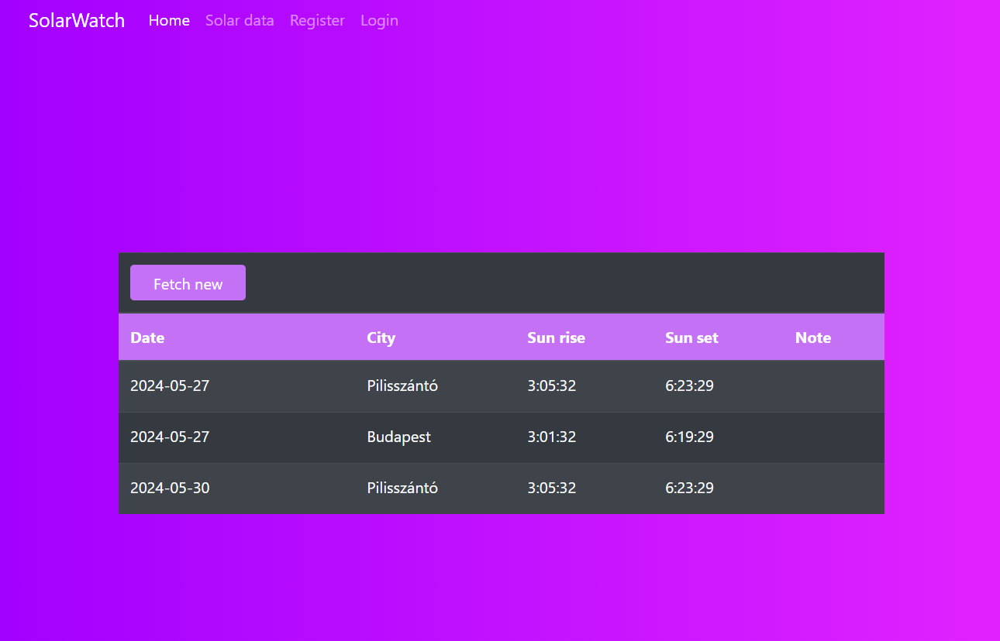

<a name="readme-top"></a>

[![Issues][issues-shield]][issues-url]
[![LinkedIn][linkedin-shield]][linkedin-url]


<!-- PROJECT LOGO -->
<br />
<div align="center">
  <h2 align="center">Solar Watch</h2>
  <a href="https://github.com/galveron/SolarWatchProject">
    
  </a>
</div>

<!-- TABLE OF CONTENTS -->
<details>
  <summary>Table of Contents</summary>
  <ol>
    <li>
      <a href="#about-the-project">About The Project</a>
      <ul>
        <li><a href="#built-with">Built With</a></li>
      </ul>
    </li>
    <li>
      <a href="#getting-started">Getting Started</a>
      <ul>
        <!-- <li><a href="#prerequisites">Prerequisites</a></li> -->
        <li><a href="#app">Check my app</a></li>
      </ul>
    </li>
    <li><a href="#contact">Contact</a></li>
  </ol>
</details>


<!-- ABOUT THE PROJECT -->
## About The Project

Utilizing the Identity Framework and React, my ASP.NET project serves as a straightforward learning endeavor where I initiated the development process by creating a basic web application.

<p align="right">(<a href="#readme-top">back to top</a>)</p>

### Built With

* [![Asp.netCore][Asp.netCore]][Asp.netCore-url]
* [![Azure][Azure]][Azure-url]
* [![React][React.js]][React-url]
* [![JavaScript][JavaScript]][JavaScript-url]

<p align="right">(<a href="#readme-top">back to top</a>)</p>

<a name="getting-started"></a>
<!-- GETTING STARTED -->
## Getting Started

To try out my application, please follow the next steps:

<!-- ### Prerequisites

* npm
  ```sh
  npm install
  ```
-->

<a name="app"></a>
### Check my app

1. Download or clone the repo.
   To clone: 
   ```sh
   git clone https://github.com/galveron/SolarWatchProject
   ```
<!--2. Install npm pacakges
   ```sh
   npm install
   ```
3. Change directory
   ```sh
   cd ../Mechty-learn/Mechty-learn-frontend
   ```
4. Start frontend
   ```sh
   npm run dev
   ```
5. Open 'http://localhost:8080' in your browser -->
 
<p align="right">(<a href="#readme-top">back to top</a>)</p>


<!-- CONTACT -->
## Contact

My profile on LinkedIn: [@veron-gal](www.linkedin.com/in/veron-gal)

Project Link: [https://github.com/galveron/SolarWatchProject](https://github.com/galveron/SolarWatchProject)

<p align="right">(<a href="#readme-top">back to top</a>)</p>


<!-- MARKDOWN LINKS & IMAGES -->
[issues-shield]: https://img.shields.io/github/issues/galveron/SolarWatchProject.svg?style=for-the-badge
[issues-url]: https://github.com/galveron/SolarWatchProject/issues
[linkedin-shield]: https://img.shields.io/badge/-LinkedIn-black.svg?style=for-the-badge&logo=linkedin&colorB=0096FF
[linkedin-url]: https://linkedin.com/in/veron-gal
[product-screenshot]: images/solar.png
[Asp.netCore]: https://img.shields.io/badge/ASP.NET_Core-512BD4?style=for-the-badge&logo=.net&logoColor=white
[Asp.netCore-url]: https://dotnet.microsoft.com/en-us/apps/aspnet
[Azure]:https://img.shields.io/badge/Microsoft_Azure-0078D4?style=for-the-badge&logo=microsoftazure&logoColor=white
[Azure-url]: https://azure.microsoft.com/en-us/free/search/?ef_id=_k_Cj0KCQjw_qexBhCoARIsAFgBlesj4zlpsF7CRNapEj4KFOyaQQQK_h9AJYF9m3mRFpVk_VZLzcc9OXcaAu0YEALw_wcB_k_&OCID=AIDcmmip7xznjm_SEM__k_Cj0KCQjw_qexBhCoARIsAFgBlesj4zlpsF7CRNapEj4KFOyaQQQK_h9AJYF9m3mRFpVk_VZLzcc9OXcaAu0YEALw_wcB_k_&gad_source=1&gclid=Cj0KCQjw_qexBhCoARIsAFgBlesj4zlpsF7CRNapEj4KFOyaQQQK_h9AJYF9m3mRFpVk_VZLzcc9OXcaAu0YEALw_wcB
[React.js]: https://img.shields.io/badge/React-20232A?style=for-the-badge&logo=react&logoColor=61DAFB
[React-url]: https://reactjs.org/
[JavaScript]: https://img.shields.io/badge/javascript-F7DF1E?style=for-the-badge&logo=javascript&logoColor=white
[JavaScript-url]: https://www.typescriptlang.org/
